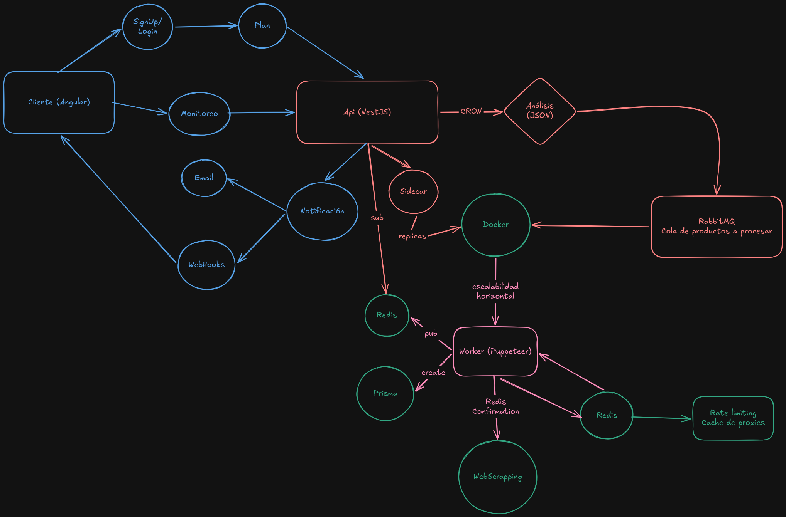
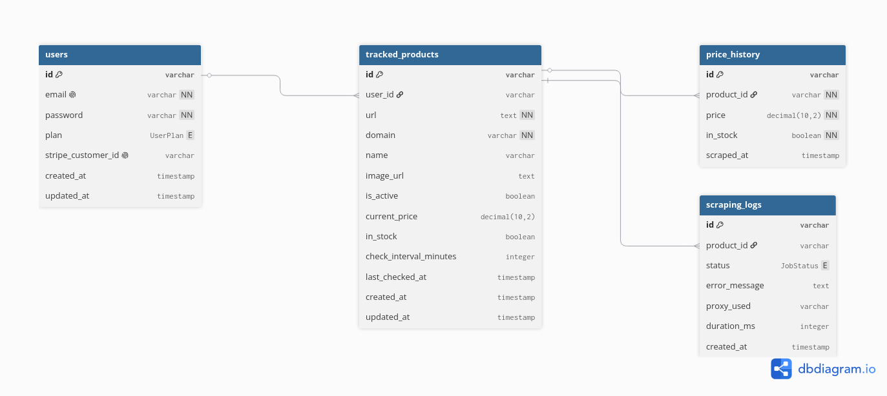

# PricePulse SaaS - Distributed Web Scraping & Price Monitoring

PricePulse es una plataforma SaaS (Software as a Service) de alto rendimiento diseñada para el monitoreo automatizado de precios y disponibilidad de stock en plataformas de comercio electrónico. 

Este proyecto implementa una **Arquitectura Basada en Eventos (EDA)** y un modelo de microservicios con escalabilidad horizontal, separando las peticiones de los usuarios del procesamiento pesado de extracción de datos mediante colas de mensajería.

---

## 🛠️ Stack Tecnológico & Arquitectura

- **Frontend**: Angular + TailwindCSS + Charts.js + Shadcn
- **API Principal:** NestJS (TypeScript) + PostgreSQL + Prisma ORM.
- **Message Broker:** RabbitMQ (Gestión de colas asíncronas de scraping).
- **Auto-scaler**: Microservicio de NestJS con child_process o un cliente ligero de Docker.
- **Caché & Rate Limiting:** Redis (Control de peticiones por dominio e histórico rápido).
- **Workers Extracted (Scrapers):** Node.js + Puppeteer / Playwright independientes.
- **Infraestructura:** Docker & Docker Compose (Orquestación y escalado de contenedores).

---

## 📐 Diseño del Sistema

El sistema mitiga la carga del servidor web delegando las tareas pesadas de scraping a Workers independientes a través de un flujo distribuido:

1. El usuario registra un enlace (URL) o un temporizador interno (*Cron*) activa un lote de monitoreos programados. Scrapping incial cuando se añade un producto nuevo.
2. La API principal empaqueta la orden de trabajo en un mensaje JSON y la publica en **RabbitMQ** (`cola.scraping`).
3. Múltiples **Workers (Puppeteer)** en contenedores aislados consumen las tareas de la cola a su propio ritmo, ejecutan el raspado web de forma asíncrona y persisten los resultados directamente en la base de datos compartida usando **Prisma**.
4. Se utiliza **Redis** para evitar bloqueos (*Rate Limiting*) controlando la frecuencia de peticiones permitidas por dominio.

---

## 🚀 Requisitos Previos

Asegúrate de tener instalado en tu entorno de desarrollo:
- Node.js (v22 o superior)
- Docker & Docker Compose

---

## 📦 Instalación y Configuración

1. **Clonar el repositorio:**
   ```bash
   git clone [https://github.com/tu-usuario/PricePulse-saas.git](https://github.com/tu-usuario/PricePulse-saas.git)
   cd PricePulse-saas
    ```

2. **Clonar variables de entorno**
    ```bash
    cp .env.example .env
    ```
3. **Levantar infra-estructura**
    ```bash
    docker compose up --scale worker=3 -d
    ```

## Licencia
Este proyecto opera bajo la mit license, vease [LICENSE](./LICENSE).

# Esquemas

## Arquitectura


## Base de datos

